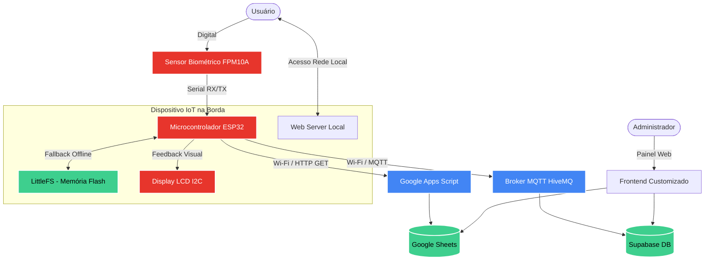

# 👆 Sistema de Presença Biométrico Automatizado em Nuvem


Uma solução completa de **Internet of Things (IoT)** desenvolvida para revolucionar a forma como o registro de presença é feito em salas de aula, universidades e ambientes corporativos. O sistema utiliza a precisão da biometria integrada ao poder computacional do **ESP32** para fornecer validação de identidade rápida, segura e altamente disponível.

## 🎯 Visão Geral do Sistema

O objetivo principal deste projeto é eliminar as antigas e ineficientes listas de papel, otimizando o tempo de gestão e mitigando fraudes ou presenças indevidas.

Desenvolvido sob uma arquitetura resiliente *(Fault-Tolerant)*, o dispositivo possui um **Sistema de Fila Offline** baseado no sistema de arquivos **LittleFS**. Caso a infraestrutura de rede local (Wi-Fi) sofra instabilidade ou queda, o hardware continua operando de forma transparente. As validações biométricas são armazenadas em cache na memória flash não volátil do ESP32 e sincronizadas automaticamente em *batch* para a nuvem no momento em que a conectividade é restabelecida.

## 📐 Arquitetura da Solução

O sistema foi desenhado para ser flexível, suportando múltiplos protocolos de comunicação (HTTP REST ou MQTT) e múltiplos serviços de persistência (Google Sheets ou Supabase).



## 🔌 Hardware & Pinagem (Pinout)

Para garantir a comunicação robusta e minimizar ruídos, recomendamos atenção aos níveis lógicos. O ESP32 opera nativamente em 3.3V, certifique-se de que a alimentação do sensor corresponda ao datasheet do modelo exato adquirido.

| Componente | Pino do Componente | Pino do ESP32 | Função / Protocolo |
| :--- | :--- | :--- | :--- |
| **Sensor Biométrico** | `TX` (Verde) | `GPIO 16` (RX2) | Comunicação Serial (UART 2) |
| **Sensor Biométrico** | `RX` (Branco) | `GPIO 17` (TX2) | Comunicação Serial (UART 2) |
| **Sensor Biométrico** | `VCC` (Vermelho) | `3V3` ou `5V` | Alimentação (Checar datasheet) |
| **Sensor Biométrico** | `GND` (Preto) | `GND` | Referência Comum (Aterramento) |
| **Display RGB LCD** | `SDA` | `GPIO 21` | Linha de Dados (I2C) |
| **Display RGB LCD** | `SCL` | `GPIO 22` | Linha de Clock (I2C) |
| **Display RGB LCD** | `VCC` | `5V` (VIN) | Alimentação |
| **Display RGB LCD** | `GND` | `GND` | Referência Comum (Aterramento) |

> ⚠️ **Nota de Engenharia:** Em ambientes com ruído eletromagnético, o uso de cabos blindados curtos para a interface UART (TX/RX) do sensor biométrico é fortemente recomendado para evitar falhas de leitura.

## 🚀 Guia de Instalação e Configuração

Siga os passos abaixo para implantar a solução no seu ambiente.

### 1. Clonagem e Dependências
O código principal usa C++ através do Arduino Core para ESP32. É necessário ter a **Arduino IDE** (ou VS Code com PlatformIO) instalada.

Abra a IDE e instale as seguintes bibliotecas através do *Library Manager*:
- `Adafruit Fingerprint Sensor Library` (Comunicação Biométrica)
- `Grove - LCD RGB Backlight` (Display I2C)
- `PubSubClient` (Apenas se for rodar os exemplos MQTT)
- `ArduinoJson` (Apenas se for rodar os exemplos MQTT)

### 2. Configuração do Ambiente Cloud
#### Opção A: Google Sheets (Padrão)
1. Crie uma nova planilha no Google Sheets.
2. Acesse `Extensões > Apps Script`.
3. Programe o backend (um exemplo simples recebendo `GET` para cadastrar presenças).
4. Realize o deploy como **Web App** (Acesso: "Qualquer pessoa") e copie a URL gerada.

#### Opção B: Supabase
1. Crie um novo projeto no [Supabase](https://supabase.com).
2. Configure uma tabela `alunos` ou `presencas`.
3. Utilize os painéis do diretório `frontend/` e informe a sua **Anon Key** e **Project URL**.

### 3. Setup das Variáveis de Ambiente (Firmware)
Abra o arquivo principal `projeto-sensor.ino` (ou um dos exemplos) e higienize os parâmetros da sua rede local e do servidor na nuvem:

```cpp
// ==== CONFIGURAÇÕES DE REDE E CLOUD ====
const char* ssid = "SEU_WIFI_AQUI";
const char* password = "SUA_SENHA_AQUI";

// URL do App Script do Google Sheets
String googleScriptURL = "URL_DO_SEU_GOOGLE_SCRIPT_AQUI";
```

### 4. Flash do Microcontrolador
- Conecte o ESP32 ao computador.
- Na IDE, selecione a placa (`ESP32 Dev Module`).
- **IMPORTANTE:** Selecione um esquema de partição que reserve espaço para o sistema de arquivos (ex: *Default 4MB with spiffs* ou *LittleFS*).
- Clique em **Upload**.

## 📁 Arquitetura do Repositório

O projeto foi refatorado utilizando padrões de mercado para facilitar a contribuição e manutenção:

```text
📦 projeto-sensor
 ┣ 📂 examples/
 ┃ ┣ 📂 exemplo_mqtt_com_app/     # Firmware alternativo integrando com broker MQTT e App de gestão
 ┃ ┣ 📂 exemplo_mqtt_simples/     # Implementação enxuta de client MQTT (HiveMQ)
 ┃ ┗ 📂 exemplo_sensor_basico/    # Teste de baixo nível e cadastro via hardware nativo
 ┣ 📂 frontend/
 ┃ ┣ 📜 frontend_google_sheets.html # Interface de administração focada no Sheets
 ┃ ┗ 📜 frontend_supabase.html      # Painel SPA integrando diretamente com Supabase via CDN
 ┣ 📜 LICENSE                     # Termos de distribuição (MIT)
 ┣ 📜 README.md                   # Documentação Oficial
 ┣ 📜 projeto-sensor.ino          # [CORE] Firmware principal de produção com persistência Offline e Servidor Web Nativo
 ┗ 📜 site.h                      # Conversão do HTML em C-string (PROGMEM) para injeção no WebServer
```

---
*Feito com foco em segurança, escalabilidade e arquitetura limpa IoT.*